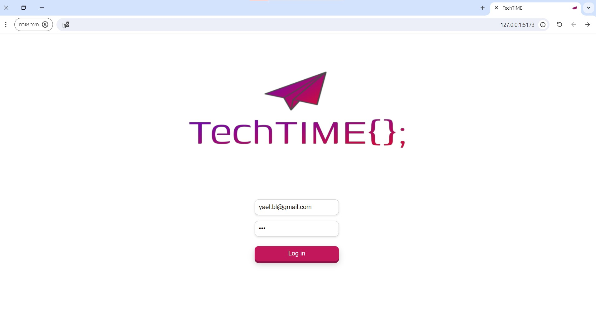
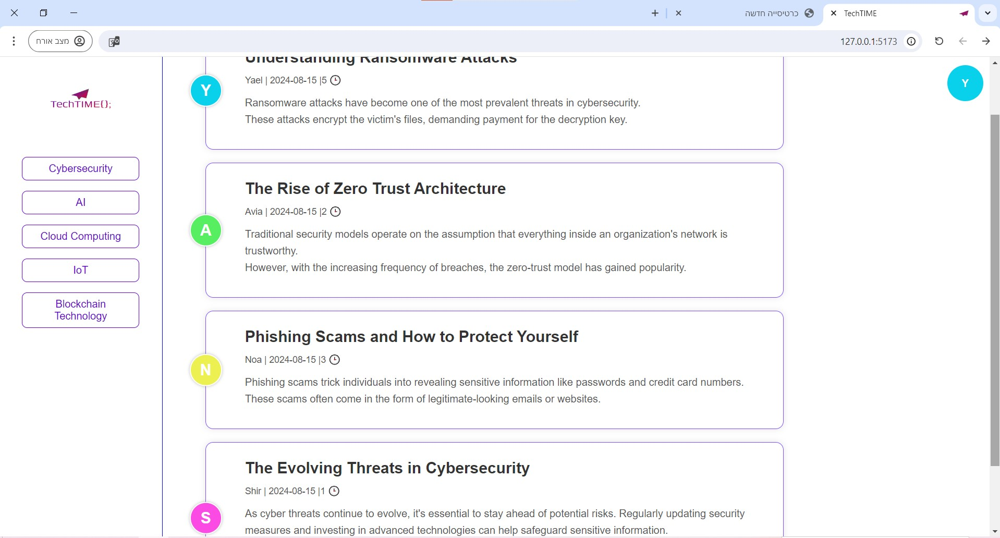
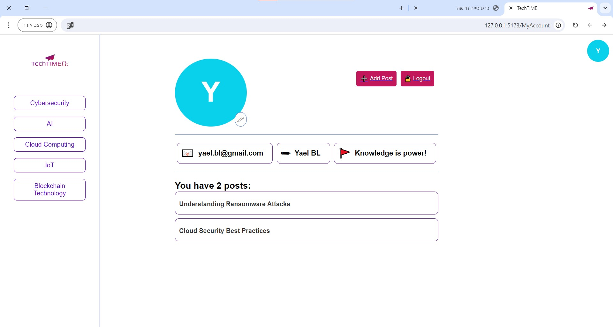
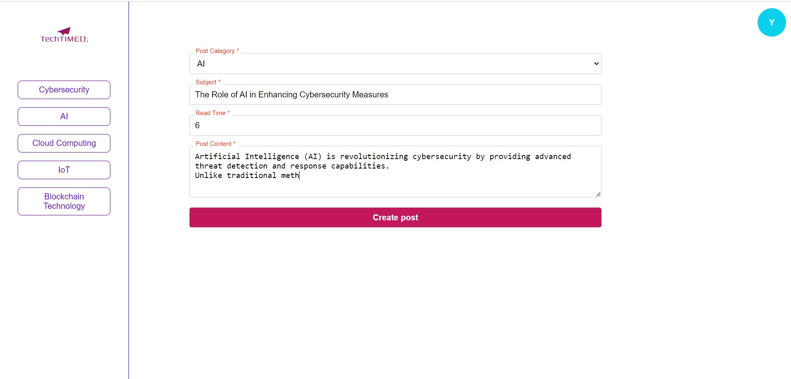
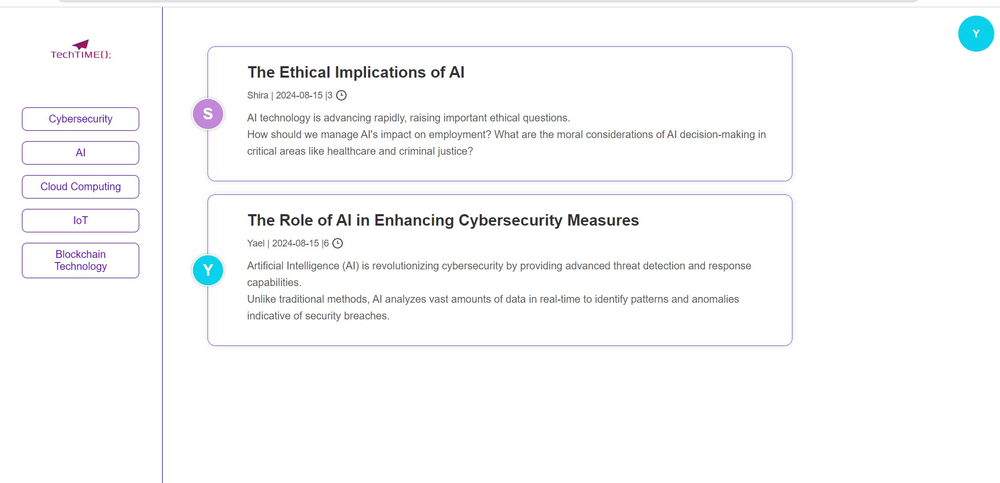
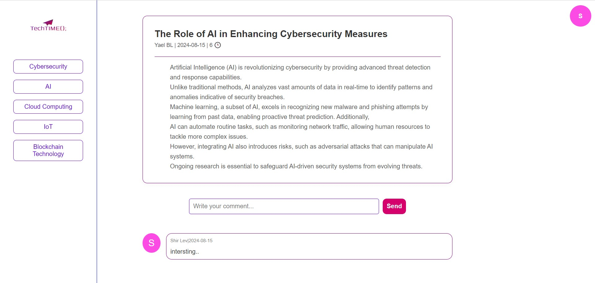
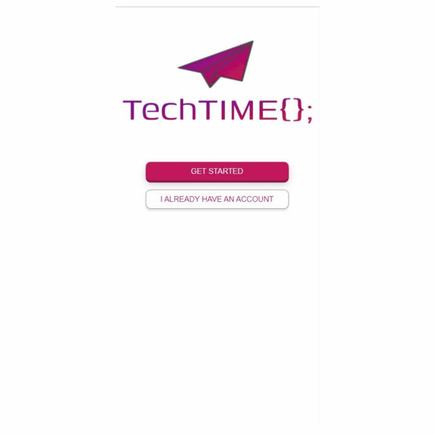

# TechTIME

This project is a full-stack application for a technology blog on various topics. The client-side is built using React and Redux Toolkit, while the server-side is powered by Java with the Spring Framework. The application is responsive and offers real-time updates for a seamless user experience.

## Key Features

- **Real-Time Updates:** Reflects changes like adding posts or comments instantly, no need to refresh the page.
- **Responsive Design:** Adapts smoothly to all screen sizes.
- **State Management:** Efficiently handled with Redux Toolkit.
- **Persistent User Session:** Users remain logged in even after refreshing the page using Local Storage.
- **Clean Code:** No reliance on design libraries, resulting in a customized UI/UX.

## Technologies Used

- **Client-Side:** React, Redux Toolkit, Axios, React Router DOM
- **Server-Side:** Java, Spring Framework
- **Development Tools:** Vite, Local Storage
- **IDE:** VS Code (for React), IntelliJ IDEA 2021.1 (for Java)

## Installation

### Prerequisites

- **Node.js**: [Download here](https://nodejs.org/)
- **Java**: [Download here](https://www.oracle.com/java/technologies/javase-jdk11-downloads.html)
- **VS Code**: [Download here](https://code.visualstudio.com/)
- **IntelliJ IDEA**: [Download here](https://www.jetbrains.com/idea/download/)

### Client-Side (React)

1. Clone the repository:
   ```bash
   git clone https://github.com/yaeliBL/TechTIME.git
   ```
2. Navigate to the client directory:
    ```bash
    cd  /TechTIME/react/techTime
    ```
3. Install dependencies:
    ```bash
    npm install
    ```
4. Start the development server:
    ```bash
    npm run dev
    ```

### Server-Side (Java)

1. Open the project in IntelliJ IDEA.
2. Navigate to the server directory.
3. Ensure all dependencies are installed via pom.xml.
4. Run the Spring Boot application.

## screenshots:
### Computer Screen View:







### Mobile View:


